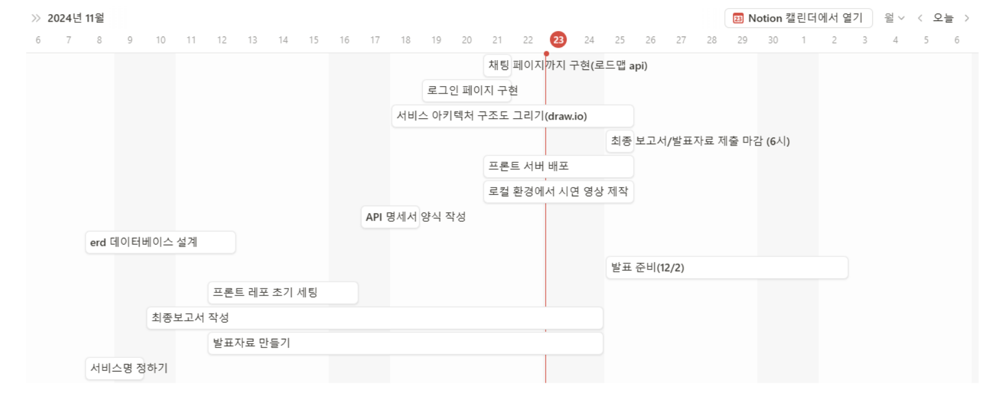
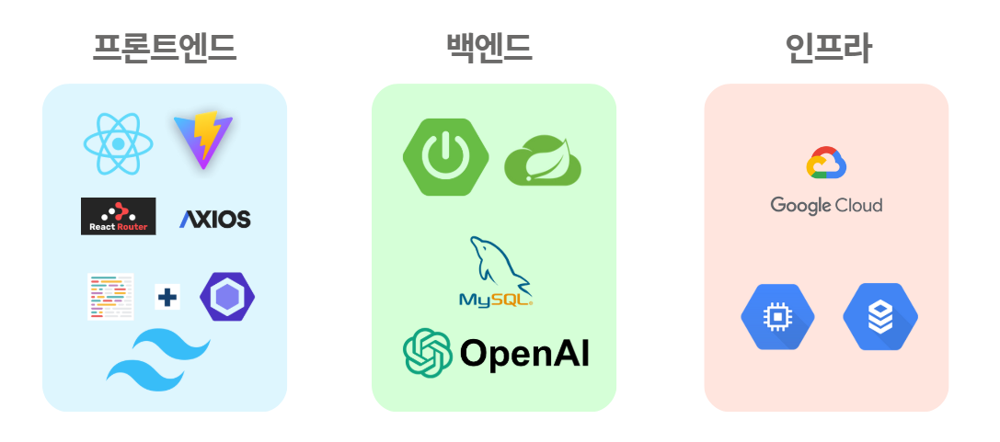
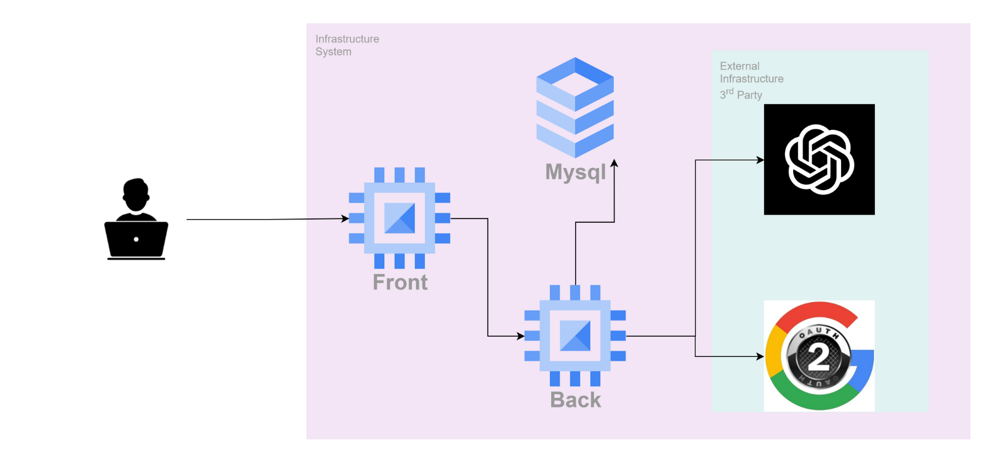
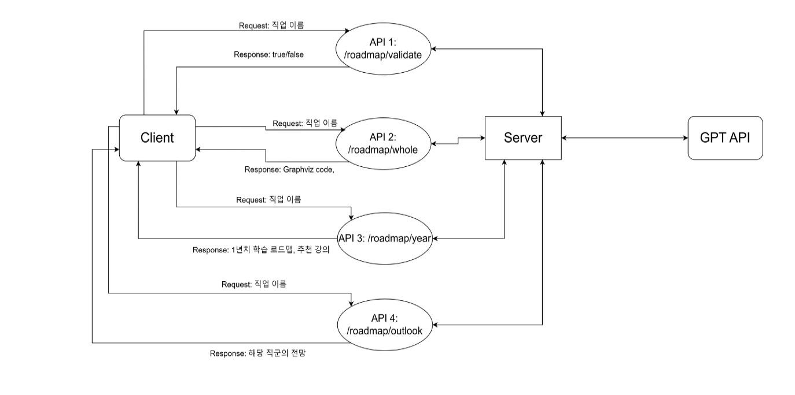

# NextRoady(넥로디)

## 인하대학교 전자상거래 기말 최종 프로젝트

### AI 기반 개발자 커리어 추천 웹사이트, NextRoady🧭

## 팀 소개

> ### [💌 Team Notion](https://absorbed-feverfew-0c5.notion.site/NextRoady-10bd1318465b80a98cafc283c6623df8?pvs=4)

전자상거래 7팀 🍨요아정입니다.
| | **김기정** | **이영주(팀장)** | **조희원** |
| --- | --- | --- | --- |
| |  |  |  |
| Github | [@whatsgoodg](https://github.com/whatsgoodg) | [@abyss-s](https://github.com/abyss-s) | [@heewon02](https://github.com/heewon02) |
| 학번 | 12213426 | 12201836 | 12211700 |
| 역할 | BE | FE | BE |
| 맡은 일 | 자료조사, 백엔드, 기말 발표 | 자료조사, 프론트엔드, ppt 제작 | 자료조사, 백엔드, 중간 발표 |

## 개발 일정 (기간)

2024.11.18 - 2024.12.02 (약 2주)

> Gantt Chart with Notion Database



## Stacks



## System Architecture



### FE 라이브러리

- React
  - JavaScript: language
  - Vite: bundler & builder
- library & package
  - react-router-dom: 페이지 라우팅
  - axios: server&api state 관리
  - tailwind css - css framework
  - eslint+Prettier: lint formater
  - react-markdown, react-zoom-pan-pinch, graphviz-react: 답변 렌더링

### API Flow



## 프로젝트 소스 폴더 구조

```plaintext
src
 ┣ apis
 ┃ ┣ auth.js
 ┃ ┣ login.js
 ┃ ┗ roadmap.js
 ┣ assets
 ┃ ┣ fonts
 ┃ ┗ images
 ┣ components
 ┃ ┣ GraphvizRenderer
 ┃ ┃ ┗ GraphvizRenderer.jsx
 ┃ ┣ Layout
 ┃ ┃ ┗ Layout.jsx
 ┃ ┣ MarkdownRenderer
 ┃ ┃ ┗ MarkdownRenderer.jsx
 ┃ ┗ YearlyRoadmapTable
 ┃ ┃ ┗ YearlyRoadmapTable.jsx
 ┣ pages
 ┃ ┣ Chat
 ┃ ┃ ┗ Chat.jsx
 ┃ ┣ Graph
 ┃ ┃ ┗ Graph.jsx
 ┃ ┣ Home
 ┃ ┃ ┗ Home.jsx
 ┃ ┗ Login
 ┃ ┃ ┣ Login.jsx
 ┃ ┃ ┗ Redirect.jsx
 ┣ App.jsx
 ┣ index.css
 ┣ main.jsx
 ┗ routes.jsx
```

## 실행 방법

```bash
npm i
npm run dev
```

## 환경변수 파일 템플릿

```plaintext
VITE_SERVER_DOMAIN=
VITE_SERVER_PORT=
VITE_SERVER_DOMAIN_PORT=

VITE_REACT_DOMAIN=
VITE_REACT_PORT=
VITE_REACT_DOMAIN_PORT=
```

## 산출물 링크

> 시연영상


> 발표자료

[Canva 링크 바로가기](https://www.canva.com/design/DAGV6TXLmjk/EY_3q4hwLYFoP2nOR5BqQg/edit?utm_content=DAGV6TXLmjk&utm_campaign=designshare&utm_medium=link2&utm_source=sharebutton)

> 보고서

[Google Drive 링크 바로가기](https://drive.google.com/file/d/1708UI4VNekpSqQLutEguhHFJ9HGIew7Y/view?usp=sharing)
